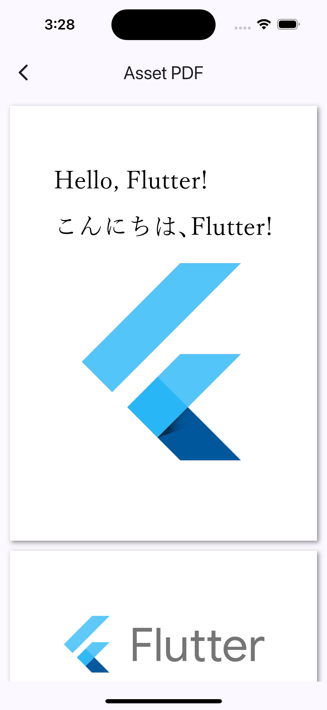

# pdf_render_maintained

[](https://pub.dev/packages/pdf_render_maintained)
[](https://opensource.org/licenses/MIT)

A maintained fork of the original `pdf_render` plugin that provides intermediate PDF rendering APIs and easy-to-use Flutter Widgets. This package is inspired by and based on the excellent work by [espresso3389](https://github.com/espresso3389).

## ⚠️ Important Notice

This package is a **maintained fork** of the original [pdf_render](https://pub.dev/packages/pdf_render) package by [espresso3389](https://github.com/espresso3389). The original package is no longer actively maintained, so this fork provides:

- ✅ **Active maintenance** and bug fixes
- ✅ **Updated dependencies** for modern Flutter versions
- ✅ **Compatibility** with latest Flutter SDK (3.0+)
- ✅ **Same API** - drop-in replacement for the original package
- ✅ **All platforms** supported (iOS, Android, macOS, Web, Windows, Linux)
- ✅ **WASM compatibility** and JS-interop-safe bindings
- ✅ **Gradle 8.11.1** support for modern Android builds
- ✅ **Swift Package Manager** support for macOS and iOS
- ✅ **Latest dependencies** (collection ^1.19.1, vector_math ^2.2.0)

### Original Package Attribution

This package is based on the original work by [espresso3389](https://github.com/espresso3389) and the [pdf_render](https://pub.dev/packages/pdf_render) package. We are grateful for their excellent work and maintain this fork to keep the package alive for the Flutter community.

**Original Repository**: https://github.com/espresso3389/flutter_pdf_render  
**Original Package**: https://pub.dev/packages/pdf_render  
**Original Author**: [espresso3389](https://github.com/espresso3389)

## 🚀 What's New – 1-Line Viewer API (1.6.x)

The maintained fork now ships with a brand-new high-level widget layer:

- **`PdfRenderView`** – four factories (`.asset`, `.file`, `.network`, `.memory`) that directly wrap the existing `PdfViewer.open*` methods. Drop it in as a single line.
- **`PdfRenderScreen`** – a batteries-included `Scaffold` with an `AppBar` and safe-area body so you can push a ready-to-use screen with `Navigator.push`.
- **`pdf_render_maintained.dart` barrel export** – import this single file to get both the classic low-level APIs and the new convenience widgets.

These additions are 100% additive; no existing API (such as `PdfDocumentLoader`, `PdfPageView`, or `PdfViewer`) was modified or removed.

## Features

- 📱 **Multi-platform support**: iOS, Android, macOS, Web, Windows, and Linux
- 🎨 **Widgets from low-level to high-level**: `PdfViewer`, `PdfDocumentLoader`, `PdfPageView`, and now `PdfRenderView`/`PdfRenderScreen`
- ⚡ **High-performance rendering**: Direct texture rendering for smooth performance
- 🔧 **Flexible APIs**: Pick between low-level composition or one-line high-level widgets
- 📄 **Multiple sources**: Load from assets, files, URLs, or memory
- 🎯 **Interactive viewing**: Pinch-zoom, pan, and navigation controls
- 🍎 **Swift Package Manager**: Full SPM support for macOS development
- 🏗️ **Modern Build Tools**: Gradle 8.11.1, latest dependencies

## Installation

Add this to your package's `pubspec.yaml` file:

```yaml
dependencies:
  pdf_render_maintained: ^1.6.1
```

Then run `flutter pub get`.

### Platform-Specific Setup

#### Swift Package Manager Support (macOS & iOS)

This package includes full Swift Package Manager (SPM) support for macOS and iOS development:

- ✅ **Package.swift**: Complete SPM configuration
- ✅ **Automatic Integration**: Flutter handles SPM integration automatically
- ✅ **No Additional Setup**: Works out of the box with Flutter projects
- ✅ **Modern Tooling**: Compatible with latest Xcode and Swift tools

**Note**: For most Flutter projects, no additional setup is required. Flutter's plugin system will automatically handle the SPM integration.

#### Android Setup

The package supports modern Android development with:
- ✅ **Gradle 8.11.1**: Latest Gradle version support
- ✅ **Kotlin 2.1.0**: Modern Kotlin support
- ✅ **API 36**: Latest Android API support
- ✅ **Automatic Integration**: No additional setup required

#### iOS Setup

Standard iOS development with:
- ✅ **Swift Support**: Full Swift compatibility
- ✅ **iOS 13.0+**: Aligned with current Flutter minimums
- ✅ **Automatic Integration**: No additional setup required

### Web Setup

For Web support, add the following script tags to your `index.html` before the main.dart.js script:

```html
<!-- IMPORTANT: load pdfjs files -->
<script
  src="https://cdn.jsdelivr.net/npm/pdfjs-dist@3.4.120/build/pdf.min.js"
  type="text/javascript"
></script>
<script type="text/javascript">
  pdfjsLib.GlobalWorkerOptions.workerSrc =
    "https://cdn.jsdelivr.net/npm/pdfjs-dist@3.4.120/build/pdf.worker.min.js";
  pdfRenderOptions = {
    cMapUrl: "https://cdn.jsdelivr.net/npm/pdfjs-dist@3.4.120/cmaps/",
    cMapPacked: true,
  };
</script>
```

## Screenshots




## Quick Start

### 1-Line Setup

```dart
import 'package:pdf_render_maintained/pdf_render_maintained.dart';

const PdfRenderView.asset('assets/hello.pdf');
const PdfRenderView.network('https://example.com/doc.pdf');
```

### Batteries-Included Screen

```dart
Navigator.push(
  context,
  MaterialPageRoute(
    builder: (_) => PdfRenderScreen.network(
      'https://example.com/doc.pdf',
      title: 'PDF Preview',
      params: const PdfViewerParams(padding: 12),
    ),
  ),
);
```

`PdfRenderScreen.*` is perfect for when you want a default `AppBar` + viewer body without assembling a full screen manually. It still accepts the same `PdfViewerParams` and can be customized further by wrapping with your own widgets if needed.

### Simple PDF Viewer

```dart
import 'package:pdf_render_maintained/pdf_render_widgets.dart';

@override
Widget build(BuildContext context) {
  return MaterialApp(
    home: Scaffold(
      appBar: AppBar(title: const Text('PDF Viewer')),
      body: PdfViewer.openAsset('assets/hello.pdf'),
    ),
  );
}
```

### Advanced Usage with Controller

```dart
import 'package:pdf_render_maintained/pdf_render_widgets.dart';

class MyPdfViewer extends StatefulWidget {
  @override
  _MyPdfViewerState createState() => _MyPdfViewerState();
}

class _MyPdfViewerState extends State<MyPdfViewer> {
  PdfViewerController? controller;

  @override
  Widget build(BuildContext context) {
    return Scaffold(
      appBar: AppBar(title: const Text('PDF Viewer')),
      body: PdfViewer.openAsset(
        'assets/hello.pdf',
        params: PdfViewerParams(
          onViewerControllerInitialized: (PdfViewerController c) {
            controller = c;
          },
        ),
      ),
      floatingActionButton: Column(
        mainAxisAlignment: MainAxisAlignment.end,
        children: [
          FloatingActionButton(
            child: Icon(Icons.first_page),
            onPressed: () => controller?.ready?.goToPage(pageNumber: 1),
          ),
          FloatingActionButton(
            child: Icon(Icons.last_page),
            onPressed: () => controller?.ready?.goToPage(pageNumber: controller?.pageCount ?? 1),
          ),
        ],
      ),
    );
  }
}
```

## API Overview

### Widgets

- **`PdfRenderView`** *(new)*: Stateless convenience widget with `.asset`, `.file`, `.network`, and `.memory` factories
- **`PdfRenderScreen`** *(new)*: Ready-made `Scaffold` that wraps a `PdfRenderView`
- **`PdfViewer`**: Full-featured PDF viewer with zoom, pan, and navigation
- **`PdfDocumentLoader`**: Loads and manages PDF documents
- **`PdfPageView`**: Renders individual PDF pages

### Core APIs

- **`PdfDocument`**: Main document class for PDF operations
- **`PdfPage`**: Individual page representation
- **`PdfPageImage`**: Rendered page image data
- **`PdfPageImageTexture`**: High-performance texture rendering

## Migration from Original Package

If you're migrating from the original `pdf_render` package, simply change your import:

```dart
// Old import
import 'package:pdf_render/pdf_render.dart';
import 'package:pdf_render/pdf_render_widgets.dart';

// New import
import 'package:pdf_render_maintained/pdf_render.dart';
import 'package:pdf_render_maintained/pdf_render_widgets.dart';
```

And update your `pubspec.yaml`:

```yaml
dependencies:
  pdf_render_maintained: ^1.6.1  # Instead of pdf_render: ^1.4.12
```

## Contributing

We welcome contributions! Please feel free to submit issues and pull requests.

## License

This project is licensed under the MIT License - see the [LICENSE](LICENSE) file for details.

## Acknowledgments

- Original package by [espresso3389](https://github.com/espresso3389)
- PDF.js by Mozilla for Web support
- The Flutter community for their continued support

---

**Note**: This package maintains compatibility with the original `pdf_render` API while providing active maintenance and updates for modern Flutter versions.
